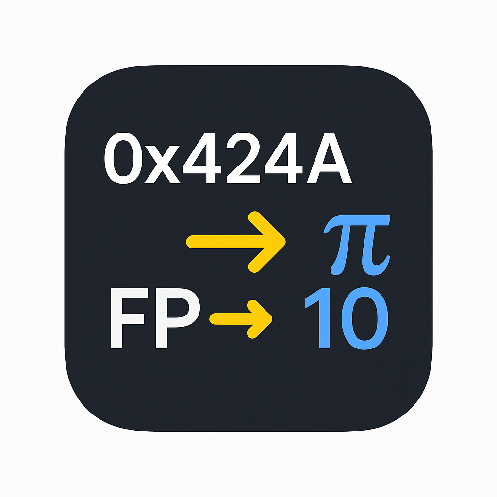
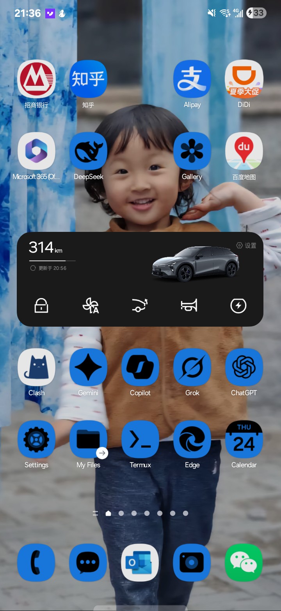

# 🔢 Cool FP Converter

<div align="center">
  
  <br/>
  <em>Professional floating-point conversion and analysis tool</em>
</div>

A precision-engineered tool for converting between binary, hexadecimal, and decimal representations across multiple floating-point formats. Built for engineers, researchers, and students who need accurate floating-point analysis and IEEE 754 visualization.

[](./LICENSE)
[](https://typescriptlang.org/)
[](https://reactjs.org/)
[](https://vitejs.dev/)

## ✨ Features

### 🔄 **Multi-Format Conversion**
- **Real-time conversion** between Binary ↔ Decimal ↔ Hexadecimal
- **6 floating-point formats** supported:
  - **FP32** (IEEE 754 Single) - 32-bit standard precision
  - **FP64** (IEEE 754 Double) - 64-bit double precision  
  - **FP16** (IEEE 754 Half) - 16-bit half precision
  - **BF16** (Brain Float) - 16-bit Google Brain format
  - **FP8** (E4M3) - 8-bit emerging ML format
  - **NVFP4** (E2M1) - 4-bit NVIDIA experimental format

### 🎯 **Precision Engineering**
- **IEEE 754 compliant** conversions with full standard support
- **Special value handling**: NaN, ±Infinity, ±Zero, subnormal numbers
- **Bit-level accuracy** with proper rounding and overflow handling
- **Input validation** with clear error messaging

### 📊 **Educational Visualization**
- **Interactive bit breakdown** showing sign, exponent, and mantissa
- **Format specifications** with bias, range, and precision details
- **Real-time updates** as you type in any input field
- **Copy-to-clipboard** functionality for easy sharing

### 📱 **Cross-Platform Support**
- **Progressive Web App** with offline capabilities
- **Android APK** available for direct installation
- **Responsive design** optimized for mobile and desktop
- **Touch-friendly** interface with accessibility support

## � Visual Showcase

### 🖥️ **Desktop Web Interface**
<div align="center">
  
  <p><em>Clean, professional interface optimized for desktop workflows</em></p>
</div>

### 📱 **Android Mobile App**
<div align="center">
  
  
  <p><em>Native Android app with intuitive touch interface and bit visualization</em></p>
</div>

### 🎬 **Real-Time Conversion Demo**
<div align="center">
  
  <p><em>Live demonstration of real-time floating-point conversion</em></p>
</div>

### 🔍 **Bit-Level Analysis**
<div align="center">
  
  <p><em>Educational visualization showing sign, exponent, and mantissa components</em></p>
</div>

## �🚀 Quick Start

### Web Application
Visit the live application at: [Your deployment URL]

### Local Development
```bash
# Clone the repository
git clone https://github.com/phoenixjyb/floating-point-conve.git
cd floating-point-conve

# Install dependencies
npm install

# Start development server
npm run dev
```

### Android Installation
Download and install the APK directly:
```bash
# Download from releases or build locally
wget https://github.com/phoenixjyb/floating-point-conve/raw/main/floating-point-converter.apk

# Install via ADB
adb install floating-point-converter.apk
```

## 📋 System Requirements

### Web Browser
- **Modern browsers** with ES2020 support
- **JavaScript enabled**
- **Local storage** for PWA functionality

### Android APK
- **Android 7.0+** (API level 24+)
- **3MB** free storage space
- **ARM64/x86_64** architecture support

### Development
- **Node.js 18+**
- **npm 8+** or **yarn 1.22+**
- **Android Studio** (for Android builds)
- **Java 17+** (for Android compilation)

## 🏗️ Architecture

### Frontend Stack
```
├── React 18 + TypeScript        # Core framework
├── Vite                         # Build tool and dev server
├── Tailwind CSS                 # Utility-first styling
├── Radix UI                     # Accessible component primitives
├── Capacitor                    # Cross-platform native runtime
└── PWA                          # Progressive web app features
```

### Project Structure
```
src/
├── components/                  # UI Components
│   ├── ui/                     # Reusable UI primitives
│   ├── BitVisualization.tsx    # Floating-point bit breakdown
│   ├── ConversionCard.tsx      # Main conversion interface
│   ├── FormatSelector.tsx      # Format switching component
│   ├── ValueRange.tsx          # Format range display
│   └── PWAInstall.tsx          # PWA installation prompt
├── lib/
│   ├── floatingPoint.ts        # Core conversion algorithms
│   └── utils.ts                # Utility functions
├── styles/                     # Global styling
└── assets/                     # Static resources

android/                        # Android platform files
├── app/                        # Android app configuration
├── gradle/                     # Build system
└── capacitor.config.json       # Capacitor configuration

public/                         # PWA assets
├── manifest.json               # Web app manifest
├── sw.js                       # Service worker
└── icon.svg                    # App icon
```

### Core Algorithms

#### Floating Point Conversion Engine
```typescript
// Convert decimal to IEEE 754 binary representation
function decimalToBinary(decimal: number, format: FloatFormat): string

// Convert binary representation to decimal value  
function binaryToDecimal(binary: string, format: FloatFormat): number

// Extract sign, exponent, and mantissa components
function getBitBreakdown(binary: string, format: FloatFormat): BitBreakdown
```

#### Format Specifications
```typescript
interface FloatFormat {
  name: string;           // Human-readable format name
  totalBits: number;      // Total bit width
  signBits: number;       // Sign bit count (always 1)
  exponentBits: number;   // Exponent field width
  mantissaBits: number;   // Mantissa/fraction field width  
  bias: number;           // Exponent bias value
  description: string;    // Format description
  range: {               // Numerical range limits
    min: number;         // Most negative finite value
    max: number;         // Most positive finite value
    minNormal: number;   // Smallest normal number
    maxNormal: number;   // Largest normal number
    smallestPositive: number; // Smallest positive value
    precision: number;   // Decimal digits of precision
  };
}
```

## 🔬 Supported Formats

| Format | Bits | Sign | Exponent | Mantissa | Bias | Precision | Range |
|--------|------|------|----------|----------|------|-----------|-------|
| **FP32** | 32 | 1 | 8 | 23 | 127 | ~7 digits | ±3.40×10³⁸ |
| **FP64** | 64 | 1 | 11 | 52 | 1023 | ~15 digits | ±1.80×10³⁰⁸ |
| **FP16** | 16 | 1 | 5 | 10 | 15 | ~3 digits | ±65,504 |
| **BF16** | 16 | 1 | 8 | 7 | 127 | ~2 digits | ±3.39×10³⁸ |
| **FP8** | 8 | 1 | 4 | 3 | 7 | ~1 digit | ±448 |
| **NVFP4** | 4 | 1 | 2 | 1 | 1 | ~1 digit | ±6 |

### Special Value Handling
- **±Zero**: Positive and negative zero representations
- **±Infinity**: Overflow handling for each format
- **NaN** (Not a Number): Invalid operation results
- **Subnormal numbers**: Gradual underflow near zero
- **Denormalized values**: Extended precision for tiny numbers

## 💻 Usage Examples

### Basic Conversion
```javascript
// Convert decimal 3.14159 to FP32 binary
decimalToBinary(3.14159, FLOAT_FORMATS.fp32)
// Returns: "01000000010010010000111111010000"

// Convert binary back to decimal
binaryToDecimal("01000000010010010000111111010000", FLOAT_FORMATS.fp32)  
// Returns: 3.141590118408203
```

### Bit Analysis
```javascript
// Analyze bit structure
getBitBreakdown("01000000010010010000111111010000", FLOAT_FORMATS.fp32)
// Returns: {
//   sign: "0",           // Positive number
//   exponent: "10000000", // Biased exponent = 128  
//   mantissa: "10010010000111111010000", // Fractional part
//   signValue: 0,
//   exponentValue: 128,   // Actual exponent = 128 - 127 = 1
//   mantissaValue: 4788186
// }
```

### Format Comparison
```javascript
// Same value in different formats
const value = 1.5;
decimalToBinary(value, FLOAT_FORMATS.fp32)  // 32-bit representation
decimalToBinary(value, FLOAT_FORMATS.fp16)  // 16-bit representation  
decimalToBinary(value, FLOAT_FORMATS.bf16)  // Brain float representation
```

## 🛠️ Development

### Prerequisites
```bash
# Install Node.js 18+
curl -fsSL https://deb.nodesource.com/setup_18.x | sudo -E bash -
sudo apt-get install -y nodejs

# Install Android Studio (for mobile builds)
# Download from: https://developer.android.com/studio
```

### Setup
```bash
# Clone and install
git clone https://github.com/phoenixjyb/floating-point-conve.git
cd floating-point-conve
npm install

# Configure environment
cp .env.example .env.local
```

### Available Scripts
```bash
# Development
npm run dev              # Start dev server (http://localhost:5173)
npm run build           # Production build
npm run preview         # Preview production build
npm run lint            # Run ESLint

# Mobile Development  
npm run build:android   # Build and open Android Studio
npx cap add android     # Add Android platform
npx cap sync android    # Sync web assets to Android
npx cap run android     # Run on Android device/emulator

# Deployment
npm run build           # Build web app
cd android && ./gradlew assembleRelease  # Build APK
cd android && ./gradlew bundleRelease    # Build AAB for Play Store
```

### Testing
```bash
# Unit tests
npm run test

# E2E tests  
npm run test:e2e

# Conversion accuracy tests
npm run test:precision
```

## 📦 Deployment

### Web Deployment
```bash
# Build for production
npm run build

# Deploy to static hosting (Vercel, Netlify, etc.)
npm run deploy
```

### Android Deployment
```bash
# Generate release APK
cd android
./gradlew assembleRelease

# APK location: android/app/build/outputs/apk/release/app-release.apk

# Generate AAB for Play Store
./gradlew bundleRelease

# AAB location: android/app/build/outputs/bundle/release/app-release.aab
```

### PWA Installation
The app automatically prompts for installation when accessed via HTTPS on supported devices.

## 🤝 Contributing

We welcome contributions! Please see our [Contributing Guide](CONTRIBUTING.md) for details.

### Development Workflow
1. **Fork** the repository
2. **Create** a feature branch (`git checkout -b feature/amazing-feature`)
3. **Commit** your changes (`git commit -m 'Add amazing feature'`)
4. **Push** to the branch (`git push origin feature/amazing-feature`)
5. **Open** a Pull Request

### Code Standards
- **TypeScript** strict mode enabled
- **ESLint** configuration with React hooks rules
- **Prettier** for code formatting
- **Conventional commits** for commit messages

## 📄 License

This project is licensed under the MIT License - see the [LICENSE](LICENSE) file for details.

## 🙏 Acknowledgments

- **IEEE 754** Standard for Binary Floating-Point Arithmetic
- **Google Brain** team for BF16 format specification
- **NVIDIA** for FP8 and experimental format research
- **React** and **TypeScript** communities for excellent tooling
- **Radix UI** for accessible component primitives

## 📞 Support

- **Issues**: [GitHub Issues](https://github.com/phoenixjyb/floating-point-conve/issues)
- **Discussions**: [GitHub Discussions](https://github.com/phoenixjyb/floating-point-conve/discussions)
- **Email**: [yanbo.jia@cantab.net](mailto:yanbo.jia@cantab.net)

---

<div align="center">

**Built with ❤️ for the engineering community**

[🌐 Live Demo](your-demo-url) • [📱 Download APK](https://github.com/phoenixjyb/floating-point-conve/raw/main/floating-point-converter.apk) • [📚 Documentation](your-docs-url)

</div>
